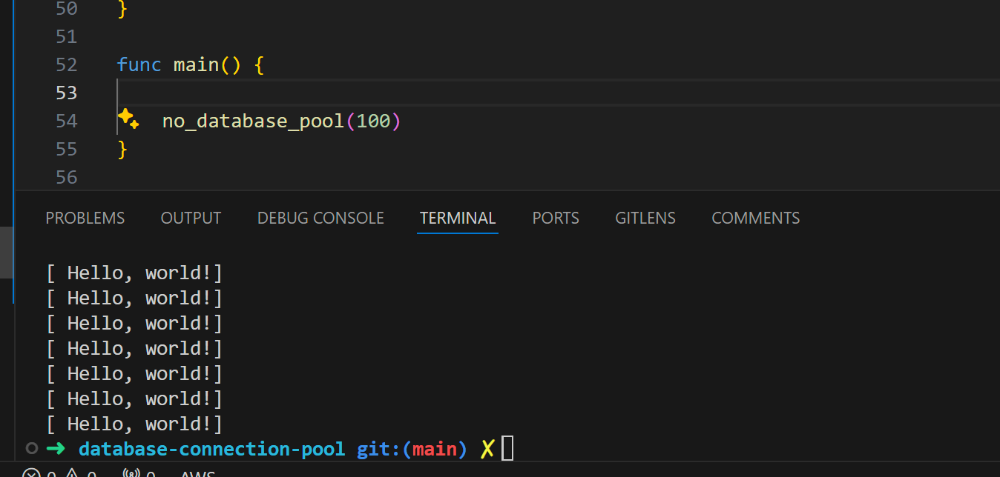
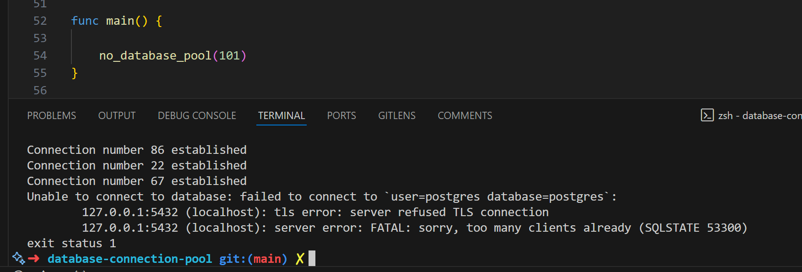
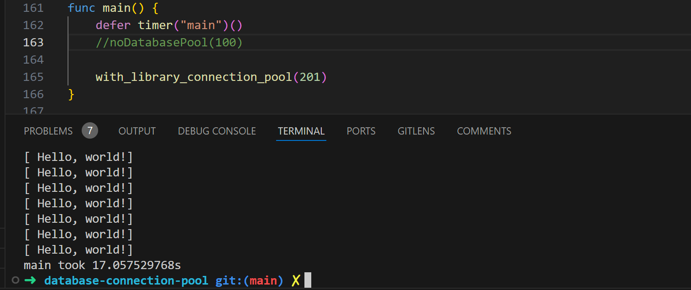
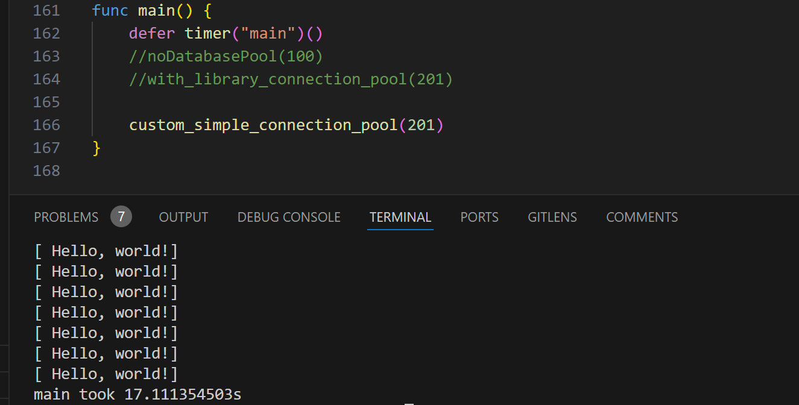

# Simple Database pool demo

Without a database pool, each request to the database will open a new connection, execute the query, and close the connection.  
Which is ineffecient due to the overhead of opening and closing connections and could also lead to errors if the database is not able to handle the number of connections.

My running queries wihout a database pool on my local postgres databse, I was able to make 100 connections before I started getting errors. This is because the default number of connections in postgres is 100.  

The image above shows the successful query with 100 connections.  
  

The image above shows the error when I tried to make the 101th connection.  

Next I used pgx library to create a database pool. With which we are able to make multiple queries wihtout exausting the number of connections.

The image above shows the successful execution of 201 queries with pgx connection pool.

Next I created my own database pool using a go channel and putting a collection of connections in the channel. I matched the number of connection used by pgx and was able to match the execution time of pgx connection pool.

The image above shows the successful execution of 201 queries with custom connection pool using go channels.  
